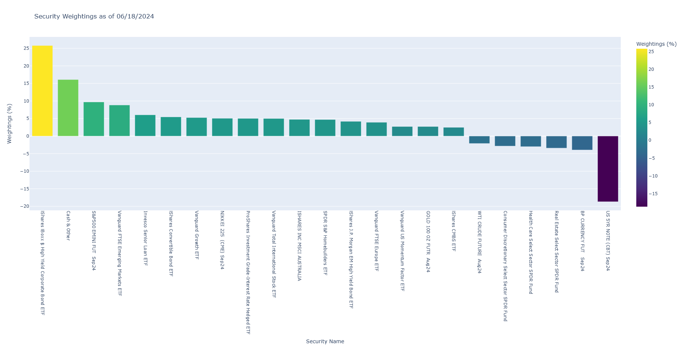

# HFND Positioning Analysis

This project aims to analyze the positioning of hedge funds using the HFND ETF, which attempts to replicate major hedge fund styles such as long/short equity, global macro, event-driven, fixed income arbitrage, emerging markets, managed futures, and multi-strategy.

## Features
- Data cleaning and preprocessing.
- Filtering securities based on weightings.
- Visualizing the data using Plotly.

## Getting Started

### Prerequisites

To run this project, you need to have the following Python libraries installed:
- pandas
- plotly

You can install these libraries using pip:
```bash
pip install pandas plotly
```

### How to Run

1. Clone the repository or download the `HFND_positioning.py` file.
2. Ensure you have the required libraries installed.
3. Run the `HFND_positioning.py` script:
   ```bash
   python HFND_positioning.py
   ```

### Script Details

The script performs the following steps:

1. **Loading the Data:**
   - The script loads data from a specified URL (CSV file) containing the ETF's holdings.

2. **Data Cleaning:**
   - It strips any leading or trailing spaces from the column names.
   - Converts the 'Weightings' column from a string percentage to a numeric value.

3. **Data Filtering:**
   - The script sorts the dataframe by 'Weightings' in descending order.
   - Filters out securities with weightings between -2% and 2%.

4. **Visualization:**
   - A vertical bar chart is created using Plotly.
   - The chart uses a gradient color scale (Viridis) to represent the weightings.
   - The x-axis is sorted by the total descending order of the weightings.
   - The chart is titled based on the date extracted from the data.

## Example Output

The script will produce an interactive bar chart displaying the security weightings. The chart will look similar to this:

 

## License

This project is licensed under the MIT License.

## Acknowledgments

- Data source: [Unlimited ETFs](https://www.unlimitedetfs.com/)
- Libraries: pandas, plotly
